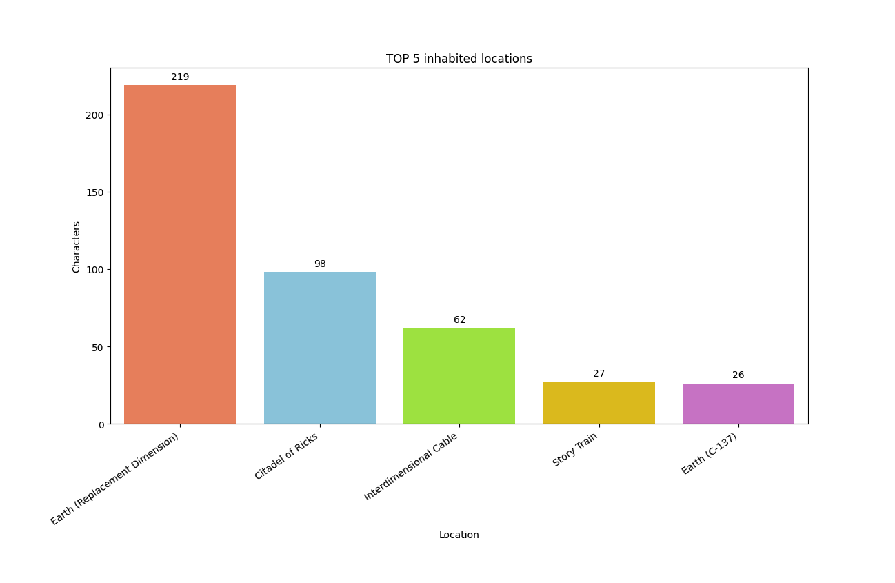
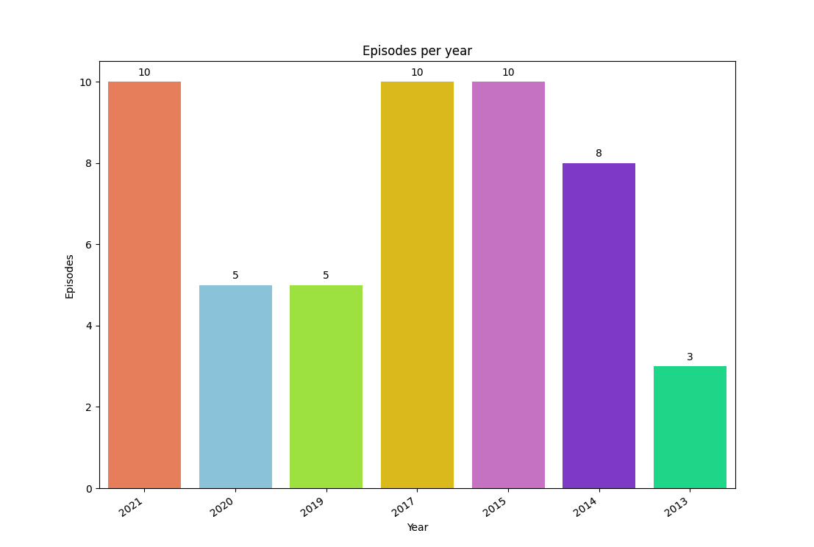

# Rick and Morty Data Analysis

Welcome to the Rick and Morty Data Analysis project! This project fetches data from the Rick and Morty API and performs various analyses to gain insights into the show's characters, locations, seasons, and episodes. 

Additionally, visualizations are done with color palette matching "Rick and Morty" colors.

## Table of Contents
- [Overview](#overview)
- [Data Sources](#data-sources)
- [Analyses Performed](#analyses-performed)

## Overview
This project analyzes data from the Rick and Morty API to answer several interesting questions about the show, such as:
- How many times each character appeared in all episodes
- How many characters are in each location
- How many unique characters were in each season
- How many episodes were released per year

## Technology
- Python
  - Polars
  - Matplotlib
  - Seaborn

## Data Sources
The data for this analysis is fetched from the [Rick and Morty API](https://rickandmortyapi.com/). This API provides comprehensive information about characters, episodes, locations, and more.

## Analyses Performed
### Character Appearances
We calculate the total number of appearances for each character across all episodes.

### Unique Characters per Season
We find out how many unique characters appeared in each season of the show.

### Characters per Location
We determine the number of characters associated with each location.

### Episodes per Year
We analyze the number of episodes released each year.

